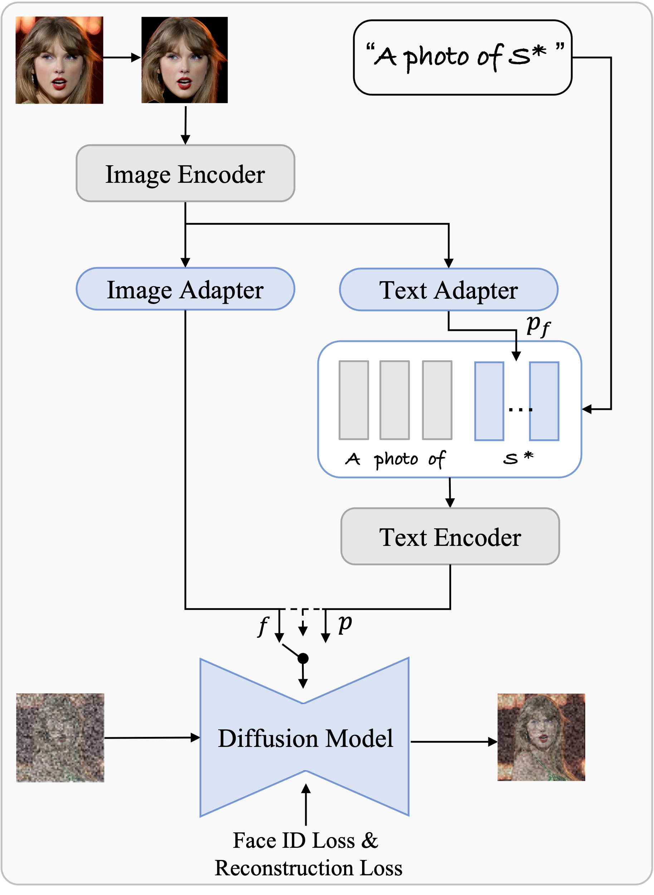

<div align="center">

# PhotoVerse: Tuning-Free Image Customization with Text-to-Image Diffusion Models (Unofficial Repo)
Implemented by: [Ido Nahum](https://github.com/idonahum), [Haim Zisman](https://github.com/Haimzis) 

[Paper](https://arxiv.org/abs/2309.05793) | [Official Website](https://photoverse2d.github.io/)
</div>

<p class="serif" style="text-align: center; font-weight: bold; font-size: 1.2em">
  ✅ only <span style="color: red; font-weight: bold">one</span> facial photograph.&nbsp;&nbsp;&nbsp;&nbsp;
  ✅ <b><span style="color: red; font-weight: bold">no</span> test-time tuning.&nbsp;&nbsp;&nbsp;&nbsp;</b>
  ✅ <b>demonstrate <span style="color: red; font-weight: bold">exceptional ID preservation and editability.</span>&nbsp;&nbsp;&nbsp;&nbsp;</b>
</p>

## Overview

PhotoVerse introduces a novel methodology for personalized text-to-image generation, enabling users to customize images based on specific concepts and prompts. Unlike existing approaches, PhotoVerse eliminates the need for test-time tuning and relies solely on a single facial photo of the target identity, significantly reducing resource costs and improving efficiency.

## Methodology

PhotoVerse incorporates a dual-branch conditioning mechanism in both text and image domains, providing effective control over the image generation process. Additionally, it introduces facial identity loss as a novel component to enhance the preservation of identity during training. After a single training phase, PhotoVerse enables the generation of high-quality images within seconds.



## Extension: Cosine Similarity Loss & Evaluation

In addition to generating images, PhotoVerse incorporates an extension for evaluating the similarity between the generated face and the ground truth (gt) image. This evaluation utilizes cosine similarity metrics calculated with the assistance of the `facenet_pytorch` module, in addition to the `arcface` module. By leveraging face detection and feature extraction modules, our generated images tend to be more realistic and similar to the real person, strengthening the personalization capability of PhotoVerse.


## Gallery

Here we present high-quality generated results achieved by leveraging a single reference image and a variety of prompts.


## Instructions

### 1. Docker Setup

Make sure you have Docker installed on your system. Then, follow these steps:

#### Build the Docker image
```bash
docker build -t photoverse .
```
#### Run the Docker container in a single command
```bash
./train_container_exec.sh
```

### 2. Dataset Preparation

To prepare the dataset, run the following script:
```bash
python prepare_celebhqmasks.py --save_path='./CelebaHQMaskDataset' --gdrive_file_id='1RGiGeumP_xVDN4RBC0K2m7Vh43IKSUPn' --force_download --force_extract --force_mask_creation --force_split
```

### 3. Training

Execute the training script using the following command:
```bash
accelerate launch --config_file single_gpu.json train.py --data_root_path CelebaHQMaskDataset/train --mask_subfolder masks --output_dir photoverse_arcface_lora --max_train_steps 40000 --train_batch_size 16  --pretrained_photoverse_path weights/photoverse_final_with_lora_config.pt --report_to wandb --use_facenet_loss
```

### 4. Inference

Run inference using pre-trained models by executing the following command:
```bash
python generate.py --model_path "runwayml/stable-diffusion-v1-5" --extra_num_tokens 4 --encoder_layers_idx 4 8 12 16 --guidance_scale 1.0 --checkpoint_path "exp1/40k_simple.pt" --input_image_path 'CelebaHQMaskDataset/train/images/23.jpg' --output_image_path "generated_image" --num_timesteps 50 --results_dir "results" --text "a photo of a {}"
```
Adjust the paths and parameters as necessary for your setup.


## BibTeX

```bibtex
@misc{chen2023photoverse,
  title={PhotoVerse: Tuning-Free Image Customization with Text-to-Image Diffusion Models},
  author={Chen, Li and Zhao, Mengyi and Liu, Yiheng and Ding, Mingxu and Song, Yangyang and Wang, Shizun and Wang, Xu and Yang, Hao and Liu, Jing and Du, Kang and others},
  booktitle={arXiv preprint arxiv:2309.05793},
  year={2023},
  archivePrefix={arXiv},
  primaryClass={cs.CV}
}
